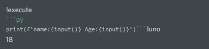
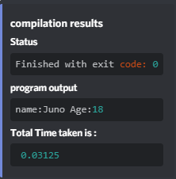

# 💻 Discord Compiler

A Discord bot which can compile code, display the output of the compiler, and run python codes. It supports python for now.

## 👩‍🏫 Usage

#### About execute command

##### Compiling a program with no STDIN


#### Sample Input:



#### Output:



## 🔰 Getting Started

#### Installation

Clone the Repository:

`git clone https://github.com/kingjuno/compiler-bot.git`

#### Dependencies

If bot fails to work on `python 3.9` or above use `python 3.8`

```python
pip install discord.py

```

#### Final Step

Go to the `Bot` settings in your App's Developer Portal copy the bot token and enable the `Server Members Intent`.

Create a new file `.env`

`cp env.template .env`

Add `BOT_TOKEN` to the `.env` file.

To start the bot ,execute the following:

```python
python -u bot.py #for Windows
python3 -u bot.py #for ubuntu
```
